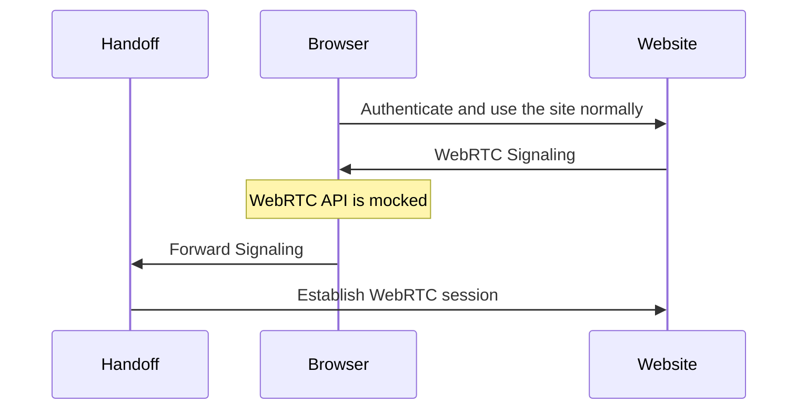

<h1 align="center">
   
  Pion Handoff
   
</h1>
<h4 align="center">Create WebRTC session in the browser—run it somewhere else</h4>

    
  
   

 

### Why
WebRTC is the real-time communication technology used for real-time media streaming. Used for things like Google Meet, Discord and Zoom on the web.
With `Handoff` you create your WebRTC session in the browser, but then move it to a process you control. This lets you do a few interesting things.

* **Record** - Join the Zoom call via `handoff` and save media as it passes through.
* **Send** - Use FFmpeg or send an external source. Not limited by browser quality/capture code.
* **Reverse Engineer**  - Capture ICE/DTLS and decrypted RTP/RTCP/SCTP traffic

### Usage

See `examples` directory. `examples/datachannel` shows a normal page with an
optional override, `examples/media-save` saves VP8 video on the backend while
still showing it in the browser, `examples/media-send` forwards VP8 RTP from
the backend into the browser, and `examples/greasemonkey` generates a
userscript that overrides `RTCPeerConnection` automatically.

Typically you will install the greasemonkey script and then run one of the examples.

### Example

Below is an example of sending a users webcam to a WebRTC service, but replacing outgoing video with a ffmpeg testsrc.
Handoff sits between the users so it can replace with any arbitrary video.

### Community
Pion has an active community on the [Discord](https://discord.gg/PngbdqpFbt).

Follow the [Pion Bluesky](https://bsky.app/profile/pion.ly) or [Pion Twitter](https://twitter.com/_pion) for project updates and important WebRTC news.

We are always looking to support **your projects**. Please reach out if you have something to build!
If you need commercial support or don't want to use public methods you can contact us at [team@pion.ly](mailto:team@pion.ly)

### Contributing
Check out the [contributing wiki](https://github.com/pion/webrtc/wiki/Contributing) to join the group of amazing people making this project possible

### License
MIT License - see [LICENSE](LICENSE) for full text
